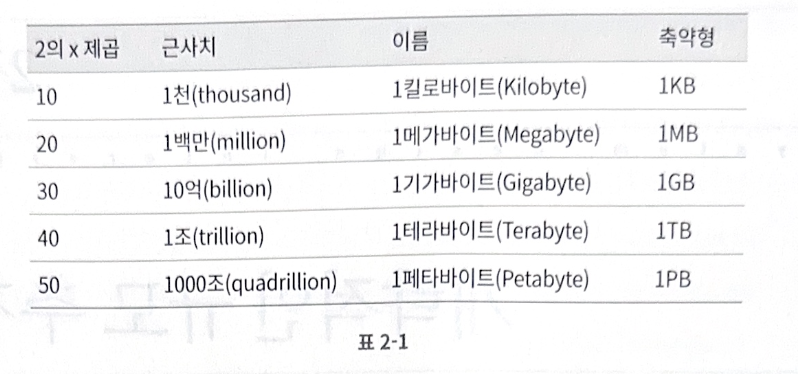
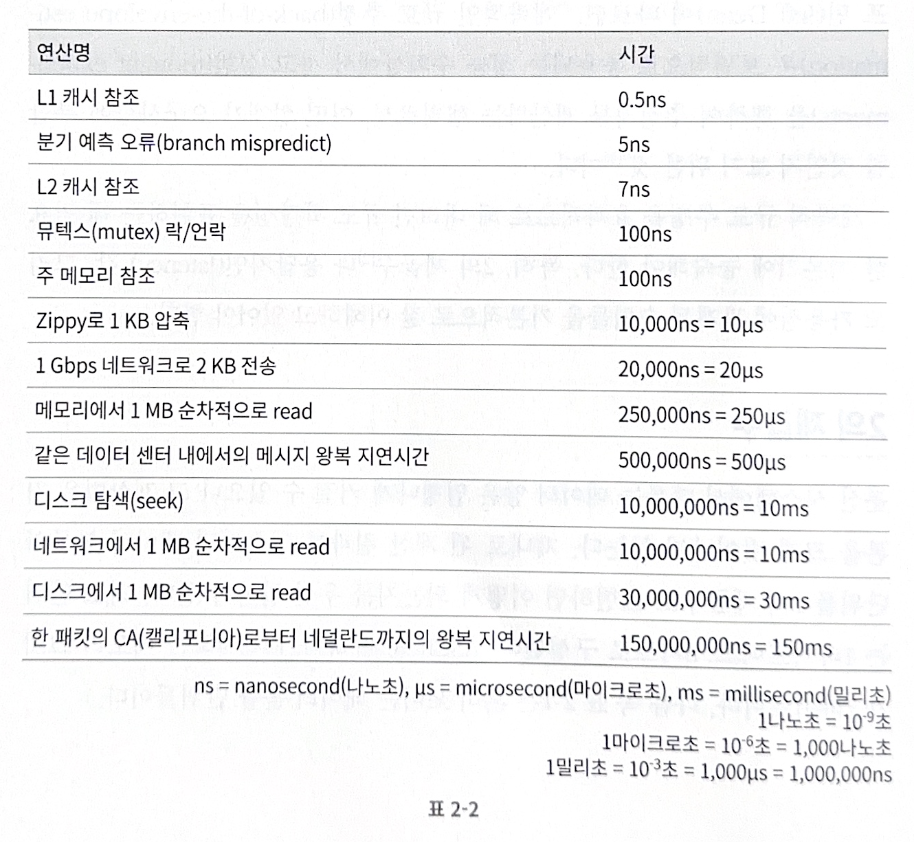
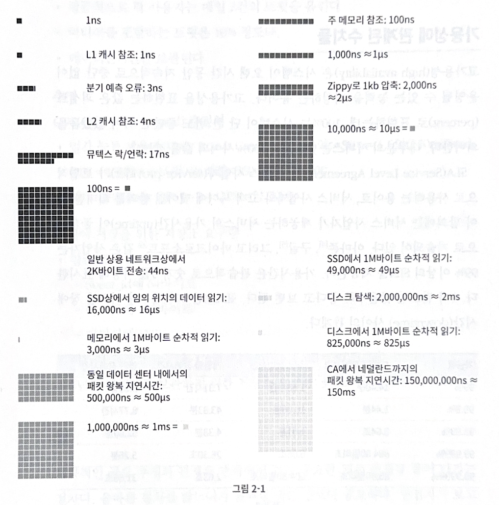
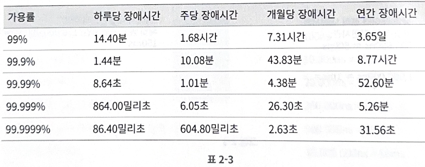

# 2장. 개략적인 규모 추정

개략적인 규모 추정(back of the envelope estimation)은 보편적으로 통용되는 성능 수치상에서 사고 실험을 행하여 추정치를 계산하는 행위로서, 어떤 설계가 요구사항에 부합할 것인지 보기 위한 것

 

## 2의 제곱수

분산 시스템의 데이터 양에 대한 제대로 된 계산 결과를 얻으려면 데이터의 볼륨의 단위를 2의 제곱수로 표현하면 어떻게 되는지 알아야 함

최소 단위는 1바이트(8비트)

ASCII 문자 하나가 차지하는 메모리 크기가 1바이트

 

 

> VARCHAR의 길이 표현 방식이 1바이트에서 2바이트로 증가하는 이유는 1 문자열의 길이가 255바이트까지만 표현 가능하니까 2의 8제곱

## 모든 프로그래머가 알아야 하는 응답지연 값

컴퓨터 연산들의 처리 속도가 어느 정도인지 짐작해보자

 

> branch mispredict란 조건문에 대한 경로를 잘못 예측했을 때 발생하는 상황    CPU가 if (x > 0) 조건이 참일 것이라고 예측하고 해당 경로의 명령어들을 미리 실행 준비했지만,   실제로는 조건이 거짓인 경우    잘못된 경로를 따라 명령어를 준비했는데 취소해서 리소스가 낭비

2020년 기준 시각화한 수치

 

결론

- 메모리는 빠르지만, 디스크는 아직도 느림

- 디스크 탐색은 가능한 한 피하자

- 단순한 압축 알고리즘은 빠름

- 데이터를 인터넷으로 전송하기 전에 가능하면 압축하자

- 데이터 센터는 여러 지역에 분산되어 있고, 센터들 간에 데이터를 주고받는 데는 시간이 걸림

## 가용성에 관계된 수치

고가용성은 시스템이 오랜 시간동안 지속적으로 중단없이 운영될 수 있는 능력을 지칭하는 용어

고가용성을 표현하는 값은 %로 표현

대부분의 서비스는 99% ~ 100%

 

SLA(Service Level Agreement)는 서비스 사업자가 사용하는 용어로 서비스 사업자와 고객 사이에 맺어진 합의를 의미

이 합의에는 서비스 사업자가 제공하는 서비스 가용시간이 공식적으로 기술

 

## 예제: 트위터 QPS와 저장소 요구량 추정

### 가정

- 월간 능동 사용자는 3억명

- 50%의 사용자가 트위터를 매일 사용

- 평균적으로 각 사용자는 매일 2건의 트윗을 올림

- 미디어를 포함하는 트윗은 10% 정도

- 데이터는 5년간 보관

 

### 추정

QPS(Query Per Second) 추정치

- 평균 트윗 크기

    - tweet_id에 64바이트

    - 텍스트에 140바이트

    - 미디어에 1MB

- 미디어 저장소 요구량: 1.5억 X 2 X 10% X 1MB = 30TB/일

- 5년간 미디어를 보관하기 위한 저장소 요구량 : 30TB X 365 X 5 = 약 55PB

 

## 팁

올바른 절차를 밟느냐가 결과를 내는 것보다 중요

면접자가 보고 싶어하는 것은 문제 해결 능력

- 근사치를 활용한 계산

    99987 / 9.1의 계산 결과를 구하는 것은 시간 낭비

    계산의 정확성을 평가하는 것이 목적이 아님

    약 100000 / 10 으로 간소화하자

- 가정들은 적어두기

- 단위를 붙이자

- 많이 출제되는 개략적 규모 추정 문제는 QPS, 최대 QPS, 저장소 요구량, 캐시 요구랑, 서버 수 등을 추정하는 것
