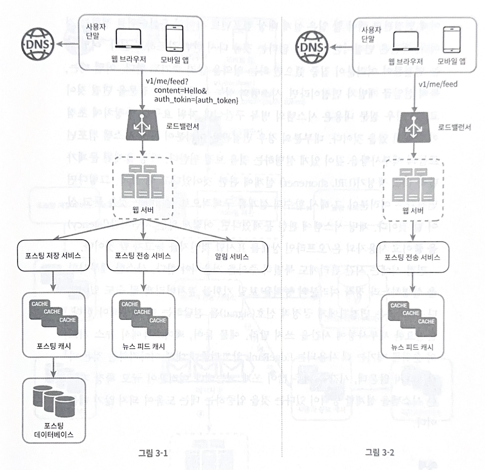
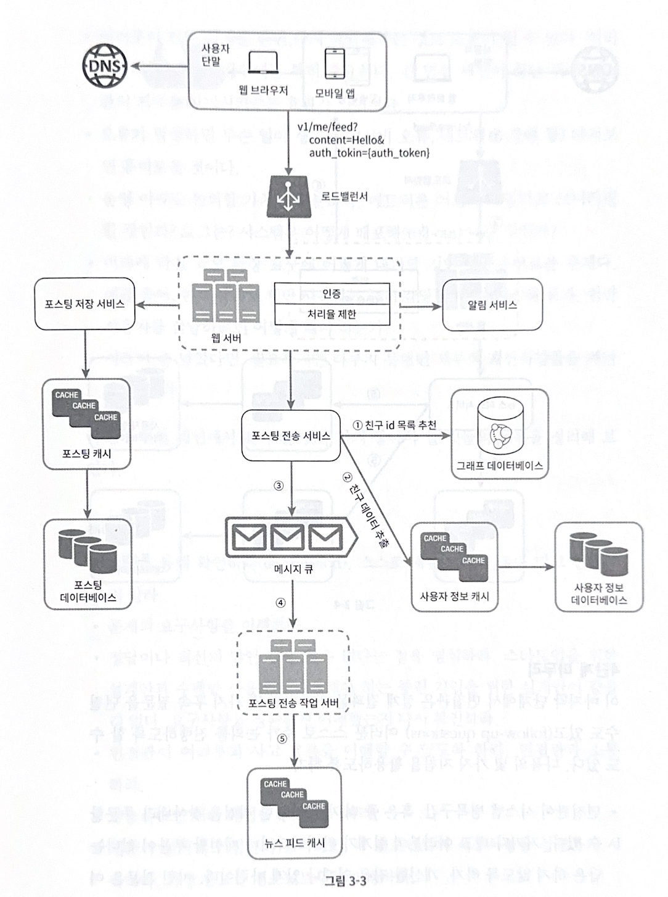
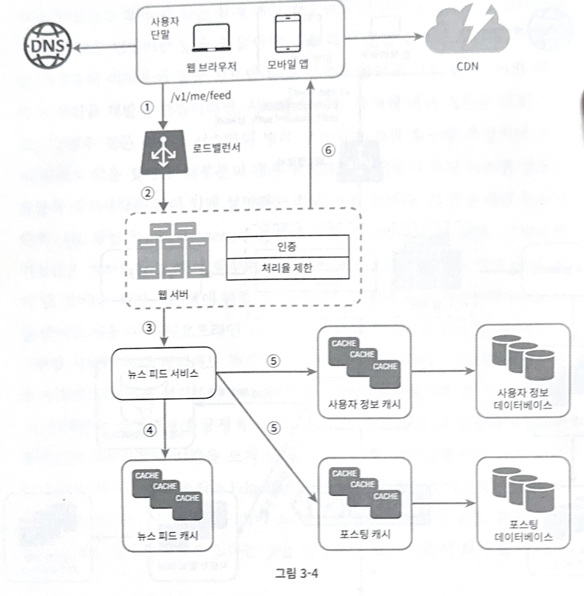

# 3장. 시스템 설게 면접 공략법

시스템 설계 면접은 두 명의 동료가 모호한 문제를 풀기 위해 협력하여 해결책을 찾아내는 과정에 대한 시뮬레이션

정답이 없기에 최종 설계안은 그다지 중요하지 않음

면접관이 시스템 설계 면접에서 찾고자 하는 것은?

지원자가 협력에 적합한 사람인지

압박이 심한 상황에도 잘 헤쳐 나갈 자질이 있는지

모호한 문제를 건설적으로 해결할 능력이 있는지

 

설계에 몰두한 나머지 타협적 결정을 도외시하고 과도한 엔지니어링을 하는 엔지니어의 완고함, 편협함은 부정적 신호

## 효과적 면접을 위한 4단계 접근법

훌륭한 설계 면접에 대한 결말과 정답은 없지만 절차나 범위에는 공통적인 부분이 존재

### 1단계. 문제 이해 및 설계 범위 확정

시스템 설계 면접을 볼 때는 바로 답을 내서는 좋은 점수를 받기 어려움

요구사항을 완전히 이해하는 것이 중요

답부터 말하지 말고 속도를 늦추자

깊이 생각하고 질문하여 요구사항과 가정을 분명히 하자

 

엔지니어가 가져야 할 가장 중요한 기술 중 하나는 올바른 질문을 하는 것, 적절한 가정을 하는 것, 시스템 구축에 필요한 정보를 모으는 것

요구사항을 이해하는 데 필요한 질문을 하자

- 구체적으로 어떤 기능을 만들어야 하는지?

- 제품 사용자 수는 얼마나 되는지?

- 회사의 규모는 얼마나 빨리 커지리라 예상하는지?

- 회사가 주로 사용하는 기술 스택은?

 

### 예제

뉴스 피드 시스템을 설계하라는 요구를 받았다고 가정

요구사항을 분명히 하기 위한 질문을 던지자

- 모바일 앱과 웹 앱 가운데 어느 쪽을 지원하는지?

- 가장 중요한 기능이 무엇인지?

- 뉴스 피드가 역순인지 아니면 특별한 정렬 기준이 있는지 (포스트마다 가중치가 부여되어야 하는지)

- 한 사용자가 최대 몇 명의 사용자와 친구를 맺을 수 있는지?

- 트래픽의 규모는?

- 피드는 어떤 형식인지?

요구사항을 이해하고 모호함을 없애는 게 가장 중요

 

### 2단계. 개략적인 설계안 제시 및 동의 구하기

개략적인 설계안을 제시하고 면접관의 동의를 얻자

- 설계안에 대한 최초 청사진을 제시하고 의견을 구하자

- 핵심 컴포넌트를 포함하는 다이어그램을 그리자

    API, 웹 서버, 데이터 저장소, 캐시, CDN, 메시지 큐 ...

- 최초 설계안이 시스템 규모에 관계된 제약사항들을 만족하는지 개략적으로 계산해보자

- 시스템의 구체적 사용 사례도 생각해보자

    미처 고려하지 못한 에지 케이스를 발견할 수 있음

 

### 예제

    뉴스 피드 시스템 설계를 이어나가자면

    개략적으로 이 설계는 두가지 flow로 나눠 생각해보자

    피드 발행과 피드 생성

    - 피드 발행

        사용자가 포스트를 올리면 관련 데이터가 캐시/DB에 기록되고 친구 뉴스 피드에 뜨게 됨

    - 피드 생성

        사용자 친구들의 포스트를 시간 역순으로 정렬

 

 

### 상세 설계

해당 목표는 달성한 상태

- 시스템에서 전반적으로 달성해야할 목표와 기능 범위 확인

- 전체 설계의 개략적 청사진 마련

- 해당 청사진에 대한 면접관의 의견 청취

- 상세 설계에서 집중해야 할 영역들 확인

 

다음으로 해야할 일은 설계 대상 컴포넌트 사이에 우선순위를 정하는 것

선임급 개발자라면 시스템의 성능 특성에 대한 질문이 있을 것이고

이 질문의 내용은 시스템의 병목 구간이나 자원 요구량 추정치에 초점

 

대부분의 경우 면접관은 특정 시스템 컴포넌트들의 세부 사항을 깊이 있게 설명하는 것을 중요시 여김

채팅 시스템에 관한 문제라면, latency를 줄이고 온오프라인 상태를 표시하는 방법을 듣고자 할 것

 

불필요한 세부사항에 시간을 쓰지 말자

 

### 예제

뉴스 피드 시스템의 개략적 설계를 마친 상황이라면 해당 내용을 깊이 탐구해보자

1. 피드 발행

2. 뉴스 피드 가져오기

 

 

 

### 4단계. 마무리

- 면접관이 시스템 병목구간 or 좀 더 개선 가능한 지점을 찾으라고 주문한다면 

    개선점을 찾아보자

    이런 질문은 비판적 사고 능력을 보일 수 있음

- 만든 설계를 다시 요약해주는 것도 도움이 될 수 있음

- 오류가 발생하면 무슨 일이 생기는지 따져보는 것도 흥미로움

- 운영 이슈도 논의

    메트릭은 어떻게 수집하고 모니터링할 것인지?

    로그는?

- 규모 확장 요구에는 어떻게 대처할 것인지도 생각해보자

 

면접 세션에서 해야 할 것

- 질문을 통해 확인하라

    스스로 내린 가정이 옳다 믿고 진행하지 마라

- 문제의 요구사항을 이해하라

- 정답이나 최선의 답안 같은 것은 없다는 것을 명심하라

- 면접관이 사고 흐름을 이해할 수 있도록 하라

- 여러 해법을 함께 제시하라

- 컴포넌트의 세부사항을 설명해보자

- 면접관의 아이디어를 이끌어내라

- 포기하지 마라

 

하지말아야 할 것

- 전형적인 면접 문제들을 대비하지 않은 채로 면접을 보지 마라

- 요구사항이나 설계를 분명히 하지 않은 상태에서 설계를 하지 마라

- 힌트를 청하기를 주저하지 마라

- 소통을 주저하지 마라

- 의견을 일찍, 자주 구해라

