# 4장. 처리율 제한 장치의 설계

네트워크 시스템에서 처리율 제한 장치(rate limiter)는 클라이언트 또는 서비스가 보내는 트래픽의 처리율을 제어하기 위한 장치

HTTP로 예를 들면 특정 기간 내에 전송되는 클라이언트의 요청 횟수를 제한

API 요청 횟수가 제한 장치에 정의된 threshold를 넘어서면 추가로 도달한 모든 호출은 처리가 중단

예를 들어

- 사용자는 초당 2회 이상 새 글을 올릴 수 없음

- 같은 IP 주소로는 하루에 10개 이상의 계정을 생성할 수 없음

- 같은 디바이스로는 주당 5회 이상 리워드를 요청할 수 없음

이번 장에서는 이러한 처리율 제한 장치를 설계해보자

<br>

API 처리율 제한 장치를 두면 좋은 점

- DoS(Denial of Service) 공격에 의한 자원 고갈을 방지

    예를 들어, 트위터는 3시간 동안 300개의 트윗만 올릴 수 있도록 제한

- 비용 절감

    추가 요청에 대한 처리를 제한하면 서버를 많이 두지 않아도 되고, 우선 순위가 높은 API에 더 많은 자원을 할당할 수 있음

    third-party API에 사용료를 지불하는 회사들에게 매우 중요

- 서버 과부하를 막을 수 있음

    봇에서 오는 트래픽이나 사용자의 잘못된 이용 패턴으로 유발된 트래픽을 걸러내는데 처리율 제한 장치를 활용할 수 있음

<br>

## 1단계. 문제 이해 및 설계 범위 확정

처리율 제한 장치를 구현하는 데는 여러 가지 알고리즘을 사용할 수 있는데 각각 장단점이 있음

다음은 면접관과의 대화

<br>

지원자 : 클라이언트 측 제한 장치? 서버 측 제한 장치?

면접관 : 서버측 API를 위한 장치

<br>

지원자 : 어떤 기준을 사용해야 하는지? IP 주소, 사용자 ID, 그 외

면접관 : 다양한 형태의 제어 규칙을 정의할 수 있도록 하는 유연한 시스템을 원함

<br>

지원자 : 시스템 규모는? 스타트업, 큰 기업?

면접관 : 대규모 요청을 처리할 수 있어야 함

<br>

지원자 : 분산 환경에서 동작?

면접관 : yes

<br>

지원자 : 독립된 서비스? 애플리케이션 코드에 포함?

면접관 : 알아서

<br>

지원자 : 처리율 제한 장치에 걸러진 경우 사용자에게 알려야 하는지?

면접관 : yes

<br>

요구사항 정리

- 설정된 처리율을 초과하는 요청은 정확하게 제한

- 낮은 응답 시간

    HTTP 응답시간에 나쁜 영향을 주어서는 곤란

- 가능한 적은 메모리

- 분산형 처리율 제한

    하나의 처리율 제한 장치를 여러 서버나 프로세스에서 공유할 수 있어야 함

- 예외 처리

    요청이 제한되었을 때 그 사실을 사용자에게 보여줘야 함

- 높은 결함 감내성 (fault tolerance)

    장애가 생기더라도 전체 시스템에 영향을 주어서는 안됨

<br>

## 2단계. 개략적 설계안 제시 및 동의 구하기

기본적인 클라이언트 - 서버 통신 모델을 사용해보자

### 처리율 제한 장치는 어디에 둘 것인가?

클라이언트, 서버 측 모두 가능

- 클라이언트 측에 둔다면?

    안정적으로 걸 수 있는 장소가 되기 어려움

    클라이언트 요청은 쉽게 위변조가 가능하기 때문

<br>

- 서버 측에 둔다면?

<p align="center">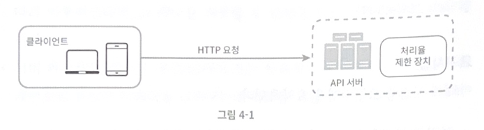</p>

<br>

처리율 제한 장치를 API 서버에 두는 대신, 처리율 제한 미들웨어를 만들어 해당 미들웨어로 하여금 API 서버로 가는 요청을 통제할 수 있도록

<p align="center">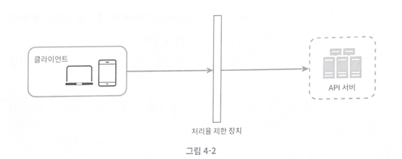</p>

<br>

<p align="center">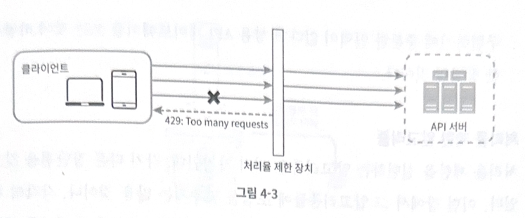</p>
    


예제의 API 서버의 처리율이 초당 2개의 요청으로 제한된 상황에서 3번째 요청을 앞의 두 요청과 같은 초 범위 내에 전송했다고 한다면

앞선 두 요청은 API로 전송될 것이고

세 번째 요청은 미들웨어에 의해 막히고 HTTP 상태코드 429(Too many requests)가 반환될 것

<br>

클라우드 마이크로 서비스의 경우 처리율 제한 장치는 API 게이트웨이라 불리는 컴포넌트에 구현

> API 게이트 웨이 <br> 처리율 제한, SSL 종단, 사용자 인증, IP 허용 목록 관리 등을 지원하는 fully managed 서비스

일단은 API 게이트웨이가 처리율 제한을 지원하는 미들웨어라는 점

<br>

처리율 제한 장치를 어디에 두어야 하는지를 중요하게 따져야 함

하지만 정답은 없음

회사의 기술 스택이나 인력, 우선순위, 목표에 따라 달라질 수 있기 때문

<br>

일반적으로 적용될 수 있는 몇 가지 지침
    
- 프로그래밍 언어, 캐시 서비스 등 기술 스택 점검

    서버 측 구현을 지원하기 충분할 정도로 효율이 높은지 확인

<br>

- 사업 필요에 맞는 처리율 제한 알고리즘

    제3 사업자가 제공하는 게이트웨이를 사용하기로 했다면 선택지는 제한될수도

<br>

- 설계가 마이크로서비스에 기반하고, 사용자 인증, IP 허용목록 관리 등을 처리하기 위해 API 게이트웨이를 설계에 포함시켰다면 처리율 제한 기능 또한 게이트웨이에 포함시켜야 할수도

<br>

- 상용 API 게이트웨이도 고려해보자

    

### 처리율 제한 알고리즘

인기 알고리즘 종류

- 토큰 버킷

- 누츨 버킷

- 고정 윈도 카운터

- 이동 윈도 로그

- 이동 윈도 카운터

<br>

### 토큰 버킷 알고리즘

간단하고 기업들이 보편적으로 사용 중 

토큰 버킷 알고리즘의 동작 원리

<br>

토큰 버킷은 지정된 용량을 갖는 컨테이너

이 버킷에는 사전 설정된 양의 토큰이 주기적으로 채워짐

꽉 찬 버킷에는 더 이상의 토큰은 추가되지 않음

<p align="center">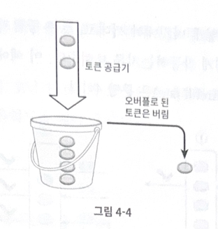</p>


예제는 용량이 4인 버킷

토큰 공급기는 매 초 2개의 토큰을 추가

버킷이 가득 차면 추가로 공급된 토큰은 버려짐

<br>

각 요청이 처리될 때마다 하나의 토큰을 사용

요청이 도착하면 버킷에 충분한 토큰이 있는지 검사

<p align="center">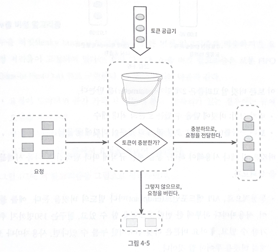</p>


충분한 토큰이 있는 경우, 토큰 하나를 꺼낸 후 요청을 시스템에 전달

토큰이 없는 경우, 해당 요청은 버려짐

<br>

<p align="center">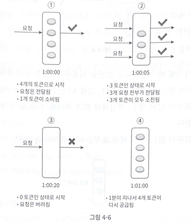</p>


토큰의 버킷 크기는 4이며, 토큰 공급률은 분당 4로 가정

<br>

토큰 버킷 알고리즘은 2개의 parameter를 받음

- 버킷 크기

    버킷에 담을 수 있는 토큰의 최대 개수

- 토큰 공급률

    초당 몇 개의 토큰이 버킷에 공급되는가

<br>

버킷은 몇 개나 사용? 공급 제한 규칙에 따라 다름

보통 API 엔드포인트마다 별도의 버킷을 둠

사용자마다 하루에 한 번만 포스팅, 친구는 150명 추가, 좋아요 버튼은 5번까지라면

사용자마다 3개의 버킷이 필요

<br>

IP 주소별로 적용해야 한다면 IP 주소마다 버킷을 하나씩

초당 10000개 요청으로 제한하고 싶다면 모든 요청이 하나의 버킷을 공유하도록

<br>

토큰 버킷 알고리즘의 장단점

장점

- 구현이 쉬움

- 메모리 사용 측면에서도 효율적

- 스파이크 트래픽 처리 가능

<br>

단점

- 버킷 크기와 토큰 공급률을 적절히 튜닝하는 것은 어려움

<br>

### 누출 버킷 알고리즘

토큰 버킷과 비슷하지만 요청 처리율이 고정되어 있음

FIFO 큐로 구현

<p align="center">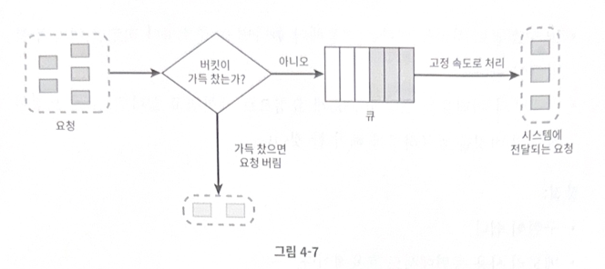</p>


동작 원리

- 요청이 도착하면 큐가 가득 차 있는지 확인

- 빈자리가 있는 경우 큐에 요청을 추가

- 큐가 가득 차 있는 경우 새 요청은 버림

- 지정된 시간마다 큐에서 요청을 꺼내어 처리

<br>

누출 버킷 알고리즘은 2개의 parameter를 사용

- 버킷 크기

    큐 사이즈

- 처리율

    지정된 시간당 몇 개의 항목을 처리할지 지정하는 값

    보통 초 단위


쇼피파이가 해당 알고리즘을 사용

<br>

누출 버킷 알고리즘의 장단점

장점

- 큐의 크기 제한으로 메모리 사용량 측면에서 효율적

- 고정된 처리율을 갖고 있기에 안정적 출력이 필요한 경우 적합

<br>

단점

- 스파이크 트래픽이 생기면 오래된 요청이 큐에 쌓이고 제때 처리 못하면 최신 요청은 버려짐

- 2개의 parameter를 적절하게 튜닝하기 까다로움

### 고정 윈도 카운터 알고리즘

동작 원리

- 타임라인을 고정된 간격의 윈도(window)로 나누고, 각 윈도마다 카운터(counter)를 붙임

- 요청이 접수될 때마다 카운터의 값은 1씩 증가

- 카운터의 값이 사전에 설정된 임계치에 도달하면 새로운 요청은 새 윈도가 열릴 때까지 버려짐

<br>

<p align="center">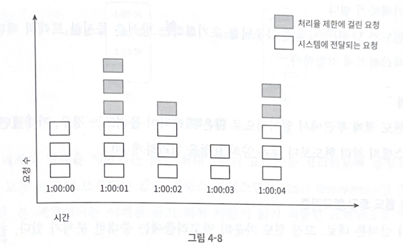</p>

해당 예제에서 타임라인의 시간 단위는 1초

초당 3개의 요청까지만 허용

매초마다 열리는 윈도에 3개 이상의 요청이 밀려오면 초과분은 버려짐

<p align="center">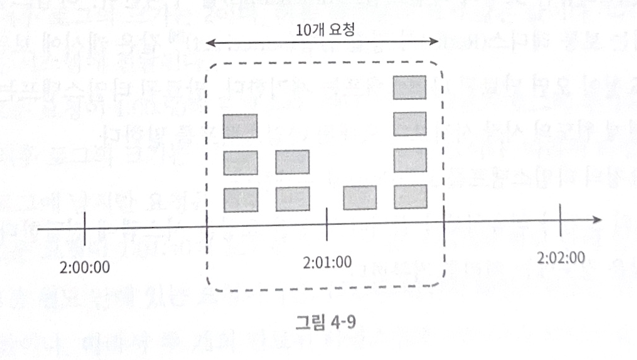</p>

이 알고리즘의 문제는 윈도 경계부분에 순간적으로 많은 트래픽이 집중될 경우 윈도에 할당된 양보다 더 많은 요청이 처리될 수 있음

분당 최대 5개의 요청만을 허용하는 시스템에 카운터는 매분마다 초기화

2시 ~ 2시 1분 사이에 5개의 요청이 들어왔고 2시 1분 ~ 2시 2분 사이에 5개의 요청이 들어옴

만약 윈도 위치를 2시 30초 ~ 2시 1분 30초로 옮긴다면 1분동안 시스템이 처리한 요청은 10개

허용 한도의 2배

<br>

장점

- 메모리 효율이 좋음

- 이해하기 쉬움

- 윈도가 닫히는 시점에 카운터를 초기화하는 방식은 특정 트래픽 패턴을 처리하기 적합

<br>

단점

- 윈도 경계 부근에 일시적으로 많은 트래픽이 몰려드는 경우, 기대했던 시스템의 처리 한도보다 많은 양의 요청을 처리하게 됨

<br>

### 이동 윈도 로깅 알고리즘

이동 윈도 로깅 알고리즘은 고정 윈도 카운터 알고리즘의 단점을 해결함

동작 원리

- 요청의 타임스탬프를 추적

    타임스탬프 데이터는 레디스의 정렬 집합같은 캐시에 보관

- 새요청이 오면 만료된 타임스탬프는 제거

    만료된 타임스탬프는 현재 윈도의 시작 시점보다 오래된 타임스탬프

- 새 요청의 타임스탬프를 로그에 추가

- 로그의 크기가 허용치보다 같거나 작으면 요청을 시스템에 전달

    그렇지 않으면 처리를 거부

<p align="center">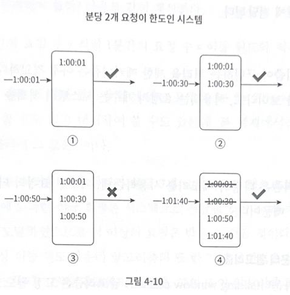</p>

<br>

해당 예제는 분당 최대 2회 요청만을 처리하도록 설정

1. 요청이 1시 1초에 도착하였을 때 로그는 비어 있는 상태이기에 요청이 허용

2. 새로운 요청이 1시 30초에 도착하고 로그에 추가

    추가 직후 로그의 크기는 2이며 허용 한도보다 크지 않은 값

3. 새로운 요청이 1시 50초에 도착하고 로그에 추가되지만 추가 직후 허용 한도보다 크기에 타임스탬프는 요청에 남지만 요청은 거부

4. 새로운 요청이 1시 1분 40초에 도착

    [1시 40초, 1시 1분 40초) 는 1분 윈도 안에 있는 요청이지만 1시 40초 이전은 전부 만료

    따라서 두 개의 만료된 타임스탬프르 로그에서 제거

    따라서 1시 1분 40초는 시스템에 전달

<br>

장점

- 메커니즘이 아주 정교

<br>


단점

- 다량의 메모리를 사용하는데, 거부된 요청의 타임스탬프도 보관하기 때문


<br>

### 이동 윈도 카운터 알고리즘

고점 윈도 카운터 + 이동 윈도 로깅

<p align="center">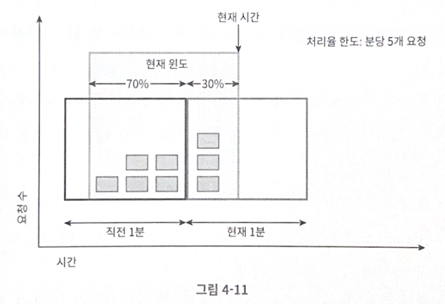</p>

<br>

처리율 한도가 분당 7개 요청으로 설정

이전 1분 동안 5개의 요청 + 현재 1분 동안 3개의 요청

현재 1분의 30% 시점에 도착한 새 요청의 경우 현재 윈도에 몇 개의 요청이 온 것으로 보고 처리해야 할까?

- 현재 1분 간의 요청 수 + 직전 1분 간의 요청수 X 이동 윈도와 직전 1분이 겹치는 비율

예제를 보면 현재 윈도에 들어있는 요청은 3 + 5 X 70% = 6.5개

내림하여 6개로 가정

<br>

장점

- 이전 시간대의 평균 처리율에 따라 현재 윈도 상태를 계산하므로 짧은 시간에 몰리는 트래픽에도 잘 대응

- 메모리 효율이 좋음

<br>

단점

- 요청이 균등하게 분포되어 있다고 가정한 상태에서 추정치를 계산하기에 다소 느슨

    하지만 해당 문제는 클라우드플레어가 실시했던 실험에 따르면 40억개 요청 중 실제 상태와 맞지 않게 허용되거나 버려진 요청은 0.003%에 불과

<br>

### 개략적인 아키텍처

처리율 제한 알고리즘의 기본 아이디어

- 얼마나 많은 요청이 접수되었는지를 추적할 수 있는 카운터를 추적 대상별로 두고

    이 카운터의 값이 어떤 한도를 넘어서면 한도를 넘어 도착한 요청은 거부

<br>

해당 카운터는 어디 보관할 것인가?

DB는 디스크 접근 때문에 느리니까 X

캐시가 바람직한데 빠르면서 만료 정책을 지원하기 때문

레디스는 처리율 제한 장치를 구현할 때 자주 사용되는 메모리 기반 저장장치로

INCR과 EXPIRE 두 가지 명령어를 지원

- INCR

    메모리에 저장된 카운터의 값을 1만큼 증가

- EXPIRE

    카운터에 타임아웃 값을 설정, 설정된 시간이 지나면 카운터는 자동 삭제

<p align="center">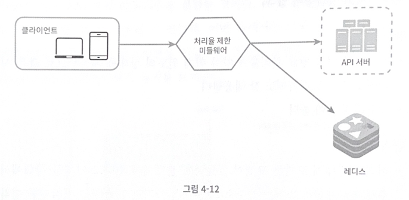</p>

<br>

동작 원리

- 클라이언트가 처리율 제한 미들웨어에게 요청을 보냄

- 처리율 제한 미들웨어는 레디스의 지정 버킷에서 카운터를 가져와서 한도에 도달했는지를 검사

    - 한도에 도달했다면 요청 거부

    - 도달하지 않았다면 API 서버로 전달

        미들웨어는 카운터의 값을 증가시킨 후 레디스에 저장

<br>

## 3단계. 상세 설게

4-12로는 해당 사항을 알 수 없음

- 처리율 제한 규칙은 어떻게 만들어지고 어디에 저장?

- 처리가 제한된 요청들은 어떻게 처리?

<br>

### 처리율 제한 규칙

리프트(Lyft)는 처리율 제한에 오픈 소스를 사용

이 컴포넌트를 살펴보자

```
domain: messaging
descriptors:
- key: message_type
  Value: marketing
  rate_limit:
     unit: day
     requests_per_unit : 5
```

해당 예제는 마케팅 메시지의 최대치를 하루 5개로 제한

```
domain: auth
descriptors:
- key: auth_type
  Value: login
  rate_limit:
     unit: minute
     requests_per_unit : 5
```

해당 예제는 클라이언트가 분당 5회 이상 로그인 할 수 없도록 제한

이런 규칙들은 config file 형태로 디스크에 저장

<br>

### 처리율 한도 초과 트래픽의 처리

`어떤 요청이 한도 제한에 걸리면 API는 HTTP 429 (Too many requests)를 클라이언트에게 보냄`

경우에 따라서는 한도 제한에 걸린 메시지를 나중에 처리하기 위해 큐에 보관할 수도 있음

예를 들어, 어떤 주문이 한도 제한에 걸리면 해당 주문들을 보관했다가 나중에 처리할 수도 있음

<br>

#### 처리율 제한 장치가 사용하는 HTTP 헤더

클라이언트는 자기 요청이 처리율 제한에 걸리고 있는지를 (throttle) 어떻게 감지할 수 있을까?

`답은 HTTP 응답 헤더에 있음`

<p align="center">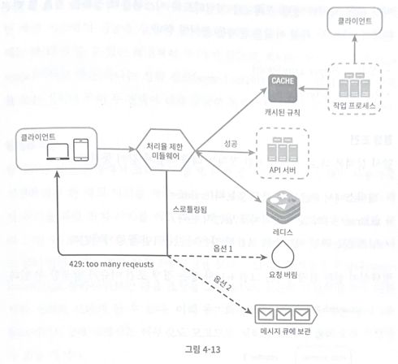</p>

<br>

해당 장치는 다음의 HTTP 헤더를 클라이언트에게 보냄

- X-Ratelimit-Remaining

    윈도 내에 남은 처리 가능 요청의 수

<br>

- X-Ratelimit-Limit

    매 윈도마다 클라이언트가 전송할 수 있는 요청의 수

<br>

- X-Ratelimit-Retry-After

    한도 제한에 걸리지 않으면 몇 초 뒤에 요청을 다시 보내야 하는지 알림

<br>

동작 순서

1. 처리율 제한 규칙은 디스크에 보관하며 작업 프로세스는 수시로 규칙을 디스크에서 읽어 캐시에 저장

2. 클라이언트가 요청을 서버에 보내면 먼저 미들웨어에 도착

3. 미들웨어는 제한 규칙을 캐시에서 가져옴

    아울러 카운터 및 마지막 요청의 타임스탬프를 레디스 캐시에서 가져옴

    가져온 값들을 근거하여 미들웨어는 처리율 제한에 걸리지 않으면 API 서버로 보내고

    걸렸다면 429 에러를 보냄

<br>

### 분산 환경에서의 처리율 제한 장치의 구현

여러 대의 서버와 병렬 스레드를 지원하도록 시스템을 확장하는 것은 해당 문제를 풀어야 함

- 경쟁 조건

- 동기화

<br>

#### 경쟁 조건

<p align="center">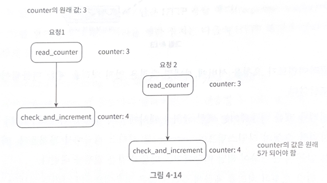</p>

<br>

병행성이 심한 환경에서는 위와 같은 경쟁 조건 이슈가 발생할 수 있음

레디스의 counter가 3이라고 하면 두 개 요청을 처리하는 스레드는 각각 병렬로 counter 값을 읽었으며 어느 쪽도 아직 변경된 값을 저장하지 않은 상태라고 가정

둘다 다른 요청의 처리 상태는 상관하지 않고 counter+1을 레디스에 기록

근데 counter는 5가 됐어야 함

<br>

경쟁 조건을 해결하는 방법 중 가장 널리 알려진 것이 lock

lock은 성능을 상당히 떨어뜨린다는 문제가 있어서 루아 스크립트와 정렬 집합이라는 레디스 자료 구조를 쓰기도 함

<br>

#### 동기화

<p align="center">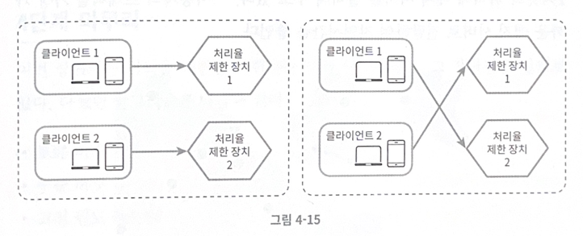</p>

<br>

서버를 여러 대 두게 되면 동기화가 필요

위의 왼쪽 그림의 경우 클라이언트 1은 제한 장치 1에 요청을 보냄

클라이언트 2는 제한 장치2에 요청을 보냄

웹은 무상태(stateless)이므로 다음 요청은 오른쪽 그림처럼 다르게 보낼 수도 있음

이 때 동기화를 하지 않는다면 제한 장치 1은 클라이언트 2에 대해 아무것도 모르기에 처리율 제한을 올바르게 수행할 수 없을 것

<br>

해결책으로는 고정 세션(stick session)을 활용하여 같은 클라이언트의 요청은 항상 같은 처리율 제한 장치로 보낼 수 있도록 하는 것

하지만 해당 방법은 확장 가능이 안되고 유연하지 않아서 비추천

<p align="center">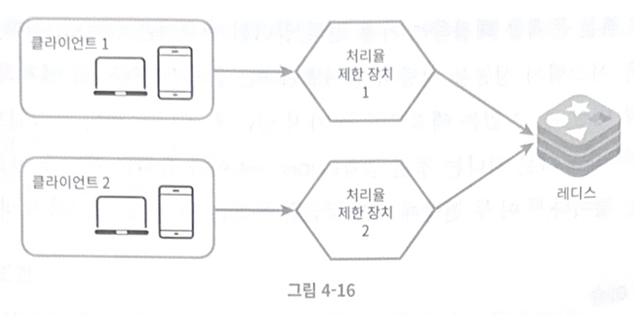</p>


더 나은 해결책은 레디스와 같은 중앙 집중형 데이터 저장소를 쓰는 것

<br>

#### 성능 최적화

성능 최적화는 시스템 설계 면접의 단골 주제

<p align="center">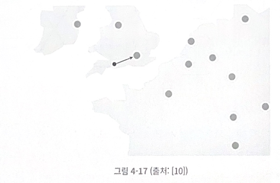</p>

<br>

대부분의 클라우드 서비스 사업자는 곳곳에 에지 서버(edge server)를 설치

사용자의 트래픽을 가장 가까운 에지 서버로 전달하여 지연 시간을 줄임

<br>

두번째로 고려해야 할 것은 데이터를 동기화할 때 최종 일관성 모델(6장의 데이터 일관성 참고)을 사용하는 것

<br>

#### 모니터링

해당 장치가 효과적으로 동작하는지 확인하기 위해 모니터링으로 데이터를 모을 필요가 있음

예를 들어 제한 규칙이 너무 빡빡하게 설정되어 있다면 많은 유효 요청이 처리되지 못할 것

깜짝 세일 같은 이벤트로 스파이크 트래픽이 생길 때는 토큰 버킷을 사용하는 방법도 있음

<br>

## 4단계. 마무리

처리율 제한 알고리즘과 장단점을 살펴봤고

아키텍처, 분산 환경에서의 처리율 제한 장치, 성능 최적화, 모니터링 등을 살펴봤음

더 나아가서는 

- hard or soft 처리율 제한

- 다양한 계층에서의 처리율 제한

을 살펴보자

현재는 7번 계층에서만을 살펴봤지만 다른 계층도 가능

<br>

처리율 제한을 회피하는 방법, 클라이언트는 어떻게 설계하는 것이 최선일까?

- 클라이언트 측 캐시를 사용하여 API 호출 횟수를 줄임

- 처리율 제한의 임게치를 이해하고 짧은 시간 동안 너무 많은 메시지를 보내지 않도록

- 예외 처리 코드 도입

- 재시도 로직을 구현할 때는 충분한 백오프 시간 두기