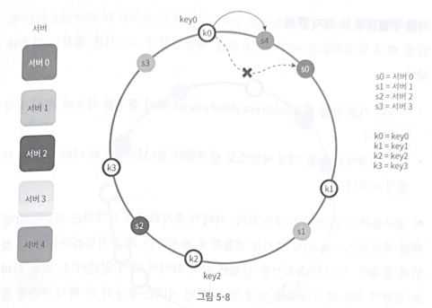

## 5장. 안정 해시 설계

수평적 규모 확장성을 달성하기 위해 요청 or 데이터를 서버에 균등하게 보내는 것이 중요

안정 해시가 이런 상황에서 쓰임

### 해시 키 재배치(rehash) 문제

N개의 캐시 서버

serverIndex = hash(key) % N (N은 서버의 개수)

 

주어진 각각의 키에 대해서 해시 값과 서버 인덱스를 계산

특정한 키가 보관된 서버를 알아내기 위해 키가 보관된 서버를 알기 위해 나머지 연산 적용

예를 들어 나머지 값이 1이 나오면

클라이언트는 캐시에 보관된 데이터를 위해 서버 1에 접속

 

서버 풀의 크기가 고정되어 있을 때

데이터 분포가 균등할 때는 잘 동작

하지만 서버 추가/삭제가 되면

해시 값은 변하지 않지만 나머지 값이 변경되어서 서버 인덱스의 값이 달라질 것

이렇게 되면 대부분의 키가 재분배 -> 캐시 미스 발생

 

### 안정 해시

안정 해시는 해당 문제를 효과적으로 해결하는 기술

해시 테이블의 크기가 조정 될 때 k/n개의 키만 재배치하는 해시 기술

k는 키의 개수이고, n은 슬롯의 개수

대부분의 전통 해시 테이블은 슬롯의 수가 바뀌면 거의 대부분의 키를 재배치하는 것을 보완

 

### 해시 공간과 해시 링

동작 원리

해시 함수는 f로 SHA-1을 사용한다고 하고

SHA-1

SHA-1 (Secure Hash Algorithm 1)은 암호학적 해시 함수 중 하나로, 데이터를 고정된 길이의 해시 값으로 변환하는 알고리즘입니다. SHA-1은 주로 데이터 무결성 검증과 디지털 서명에 사용되었습니다.

### SHA-1의 주요 특징

1. **입력의 길이 무관:** SHA-1은 입력 데이터의 길이에 상관없이 항상 160비트(20바이트)의 해시 값을 생성합니다.
2. **고유한 해시 값:** 동일한 입력 데이터는 항상 동일한 해시 값을 생성하며, 작은 변화라도 입력 데이터에 생기면 완전히 다른 해시 값이 나옵니다.
3. **단방향성:** 해시 값을 보고 원래 입력 데이터를 유추하는 것은 매우 어렵습니다.

### 예시를 통한 SHA-1 이해

#### 1. 문자열 해싱
입력 데이터가 문자열 "hello"라고 가정해보겠습니다.

- 입력 데이터: "hello"
- SHA-1 해시 값: `2cf24dba5fb0a30e26e83b2ac5b9e29e1b161e5c`

#### 2. 작은 변화에 따른 큰 변화
입력 데이터가 "hello!"로 바뀌면, 해시 값은 완전히 달라집니다.

- 입력 데이터: "hello!"
- SHA-1 해시 값: `f572d396fae9206628714fb2ce00f72e94f2258f`

이처럼 입력 데이터에 아주 작은 변화가 있어도 해시 값은 크게 변합니다.

### SHA-1의 사용 사례

1. **데이터 무결성 검증:** 파일이나 메시지가 전송되는 동안 변경되지 않았음을 확인하기 위해 사용됩니다. 예를 들어, 파일을 다운로드할 때 원본 파일의 SHA-1 해시 값을 제공하고, 다운로드한 파일의 SHA-1 해시 값을 계산하여 일치하는지 확인합니다.
   
2. **디지털 서명:** 문서나 메시지에 서명을 하여 원본임을 증명하고, 이후 내용이 변경되지 않았음을 검증하는 데 사용됩니다.

### SHA-1의 보안 문제

SHA-1은 한때 매우 인기 있었으나, 이제는 보안 취약점 때문에 더 이상 권장되지 않습니다. 주요 문제는 충돌 발생 가능성입니다. 두 개의 서로 다른 입력 데이터가 동일한 SHA-1 해시 값을 가질 수 있는 가능성이 있다는 것입니다. 실제로 충돌을 찾는 효율적인 방법이 발견되었기 때문에 SHA-1은 더 이상 안전하지 않은 것으로 간주됩니다.

### 대안으로 사용되는 해시 함수

SHA-1의 보안 문제로 인해 SHA-256, SHA-3 등의 더 안전한 해시 함수가 사용되고 있습니다.

- **SHA-256:** SHA-2 패밀리 중 하나로, 256비트(32바이트)의 해시 값을 생성합니다.
- **SHA-3:** 최근에 개발된 해시 함수로, 다양한 비트 크기(224, 256, 384, 512)를 지원합니다.

### 요약

SHA-1은 데이터를 고정된 길이의 160비트 해시 값으로 변환하는 암호학적 해시 함수입니다. 데이터 무결성 검증과 디지털 서명에 사용되었지만, 보안 취약점으로 인해 현재는 SHA-256, SHA-3 등의 더 안전한 해시 함수로 대체되고 있습니다.

 

함수의 출력 값 범위는 x0, x1 ... xn

SHA-1의 해시 공간 0 ~ 2의 160제곱 -1 -> SHA-1은 항상 160비트를 return 값으로 주기 때문

x0 = 0

xn = 2의 160제곱 -1일 때 해당 해시 공간을 그림으로 표현하면 위의 그림

해시 공간을 양쪽으로 구부려 접으면 해시 링이 만들어짐

 

### 해시 서버

해시 함수 f를 사용하면 서버 IP나 이름을 이 링 위의 어떤 위치에 대응시킬 수 있음

4개의 서버를 해시 링에 배치

 

### 해시 키

해시 키 재배치 문제에서 사용하는 나머지 연산 해시 함수가 아님

캐시할 키 key0 ~ key3 해시 링 위의 어느 지점에 배치

 

### 서버 조회

어떤 키가 저장되는 서버는 해당 키의 위치로부터 시계 방향으로 링을 탐색해 나가면서 만나는 첫 번째 서버

 

### 서버 추가

서버를 추가해도 키 가운데 일부만 재배치

 

### 서버 제거

서버가 제거되면 키 가운데 일부만 재배치

 

### 기본 구현법의 두 가지 문제

안정 해시의 기본 절차

- 서버와 키를 균등 분포(uniform distribution) 해시 함수를 사용해서 해시 링에 배치

- 키의 위치에서 링을 시계 방향으로 탐색하다 만나는 최초의 서버가 키가 저장될 서버

 

접근법의 두가지 문제

첫번째, 서버가 추가되거나 삭제되는 상황에서 파티션(인접한 서버 사이의 해시 공간)의 크기가 균등하게 유지하는 게 불가능

어떤 서버는 작은 해시 공간을 할당받고, 어떤 서버는 큰 해시 공간을 할당받는 상황이 생김

두번째, 키의 균등 분포를 달성하기 어려움

 

### 가상 노드

해당 문제를 해결하기 위해 가상 노드 or 복제를 사용

가상 노드는 실제 노드 또는 서버를 가리키는 노드

하나의 서버는 링 위에 여러 개의 가상 노드를 가질 수 있음

서버 0과 서버 1은 3개의 가상 노드를 갖고

서버 0을 링에 배치하기 위해 s0 하나만 쓰는 대신, s0_0, s0_1, s0_2 세 개 가상 노드를 사용

각 서버는 하나가 아닌 여러 개의 파티션을 관리

키의 위치로부터 시계 방향으로 링을 탐색하다가 만나는 최초의 가상 노드가 해당 키가 저장될 서버

가상 노드의 개수를 늘리면 키의 분포는 점점 더 균등

100 ~ 200개의 가상 노드를 사용했을 경우 표준 편차의 값은 5 ~ 10% 사이

그러나 가상 노드 데이터를 저장할 공간이 더 많이 필요해서 tradeoff가 필요

 

### 재배치할 키 결정

서버가 추가/제거되면 데이터 일부는 재배치

어느 범위의 키들이 재배치될까?

예를 들어 서버 4가 추가됐으면

이에 영향 받은 범위는 s4(새로 추가된 노드)부터 반시계 방향에 있는 첫 번째 서버 s3까지

즉, s3 ~ s4 사이에 있는 키들을 s4로 재배치

삭제되는 경우도 마찬가지

 

### 마치며

안정 해시가 왜 필요하며 어떻게 동작하는지

안정 해시의 이점

- 서버가 추가되거나 삭제될 때 재배치되는 키의 수가 최소화

- 데이터가 보다 균등하게 분포되므로 수평적 규모 확장성을 달성하기 쉬움

- 핫스팟 키 문제를 줄임

    특정 샤드에 대한 접근이 지나치게 빈번하면 서버 과부화 문제

